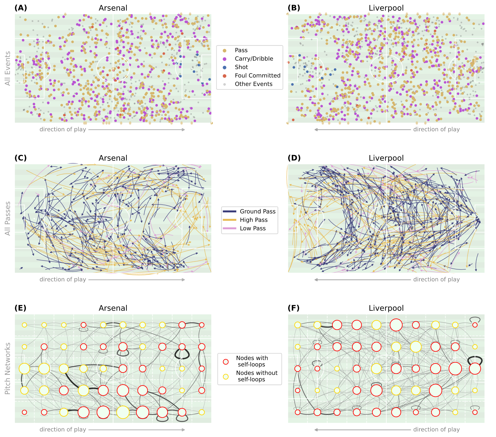

# Harder, shorter, sharper, forward: A comparison of women's and men's elite football gameplay (2020-2025)

Welcome to the folder containining data, code, and materials for the following paper:

Carstens, R., Deshpande, R., Esteve, P., Fidelibus, N., Neven, S. L., Ottow, R., ... & Torricelli, M. (2025). "[Harder, shorter, sharper, forward: A comparison of women's and men's elite football gameplay (2020-2025)](https://arxiv.org/abs/2506.22119)". arXiv preprint arXiv:2506.22119.

_Elite football is changing — and the data proves it. Analysing 13,018 matches across ten men's and women's leagues in England, Spain, Germany, Italy, and the USA (2020–2025), we show that the modern game is faster, more precise, and more compact than ever. Teams pass more, press harder, and shoot closer to goal. Women's football is evolving fastest. And beneath it all, a universal truth: the best teams don't spread the ball wide — they move it short, sharp, and forward._

---

## Data

Although the data used in this study are not publicly available (provided under license from [Hudl StatsBomb](https://statsbomb.com/)), an equivalent surrogate dataset (same provider and same format) can be found in the [StatsBomb open-data repository](https://github.com/statsbomb/open-data).

---

## At a glance


Arsenal vs Liverpool, seen through the lens of network science: each zone of the pitch is a node, each pass a connection — revealing how teams really move the ball.

## Code

| Script | Description |
|--------|-------------|
| [`pitch_network_construction.py`](./pitch_passing_network/pitch_network_construction.py) | Builds directed weighted pitch-passing networks from match event data using a 10×5 spatial grid |
| [`network_metrics.py`](./pitch_passing_network/network_metrics.py) | Computes network-level metrics: outreach, maximum eigenvalue, average shortest path length |
| [`kpis.py`](./kpis/kpis.py) | Computes match-level KPIs: pass accuracy, passes per possession, passes under pressure, vertical play, and more |


## Acknowledgements

This work is the output of the [Complexity72h](https://www.complexity72h.com) workshop, held at Universidad Carlos III de Madrid, Spain, 23–27 June 2025.

---

## Citation

If you use this code or findings from this paper in your work, please cite:

```bibtex
@article{carstens2025harder,
  title     = {Harder, shorter, sharper, forward: A comparison of women's and men's elite football gameplay (2020-2025)},
  author    = {Carstens, Rebecca and Deshpande, Raj and Esteve, Pau and Fidelibus, Nicol\`o and Linde Neven, Sara and Ottow, Ramona and Lokamruth, K. R. and Rodr\'iguez-S\'anchez, Paula and Santagata, Luca and Buld\'u, Javier M. and Klein, Brennan and Torricelli, Maddalena},
  journal   = {arXiv preprint arXiv:2506.22119},
  year      = {2025}
}
```
